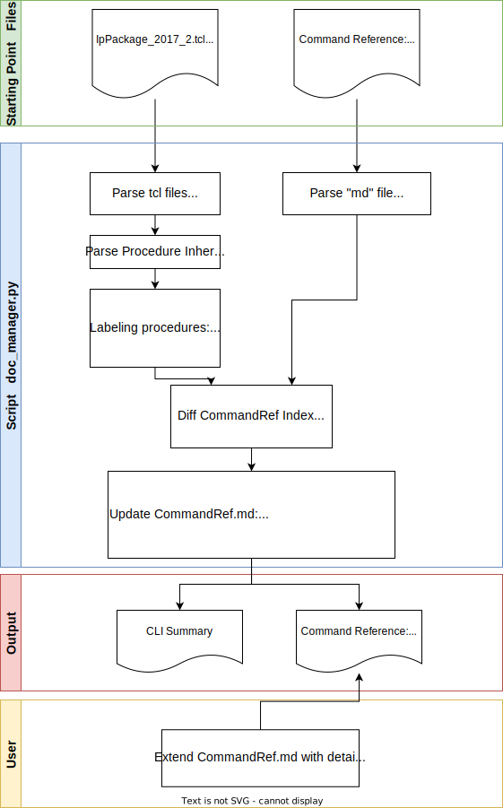

# WIP: Command Reference / Documentation

## Documentation Workflow

The python script `doc_manager.py` is used as a helper script to check consistency between the `CommandRef.md` and the `*.tcl` code.
It is not completely generating the documentation but it provides:
* Add missing procedures to doc
* Mark not implemented procedures
* Labeling procedures with supported version



### Example Output

```
---------- -------------------- --------------- --------------------
Version    Procedure            Flag            DocCmdRef
---------- -------------------- --------------- --------------------
2017_2     version_check        new             version_check
2017_2     baa                  new
2017_2     old                  new
2017_2     foo                  new
2017_2     set_vendor           new             set_vendor
---------- -------------------- --------------- --------------------
2020_1     foo                  overwrite
2020_1     abb                  new
2020_1     old                  deprecated
2020_1     version_check        import          version_check
2020_1     baa                  import
2020_1     set_vendor           import          set_vendor
---------- -------------------- --------------- --------------------
2022_1     abb                  overwrite
2022_1     zah                  new
2022_1     xyt                  new
2022_1     set_logo_relative    new             set_logo_relative
2022_1     foo                  deprecated
2022_1     old                  deprecated
2022_1     version_check        import          version_check
2022_1     baa                  import
2022_1     set_vendor           import          set_vendor
---------- -------------------- --------------- --------------------

```

### Example Command Ref Index

| **Command**                                       | **Description** | **2017.2** | 2020.1 | 2022.1 |
| ----                                              | ----            | :----:     | :----: | :----: |
| _General Commands_                                |                 |            |        |        |
| [init](#init)                                     |                 | X          | X      | X      |
| _Configuration Commands_                          |                 |            |        |        |
| [version_check](#version_check)                   |                 | X          | X      | X      |
| [set_description](#set_description)               |                 | X          | X      | X      |
| [set_vendor](#set_vendor)                         |                 | X          | X      | X      |
| [set_vendor_short](#set_vendor_short)             |                 | X          | X      | X      |
| [set_vendor_url](#set_vendor_url)                 |                 | X          |        | X      |
| [set_logo_relative](#set_logo_relative)           |                 |            |        | X      |
| [set_datasheet_relative](#set_datasheet_relative) |                 |            |        | X      |
| _Run Commands_                                    |                 |            |        |        |
| [package_ip](#package_ip)                         |                 | X          | X      | X      |


